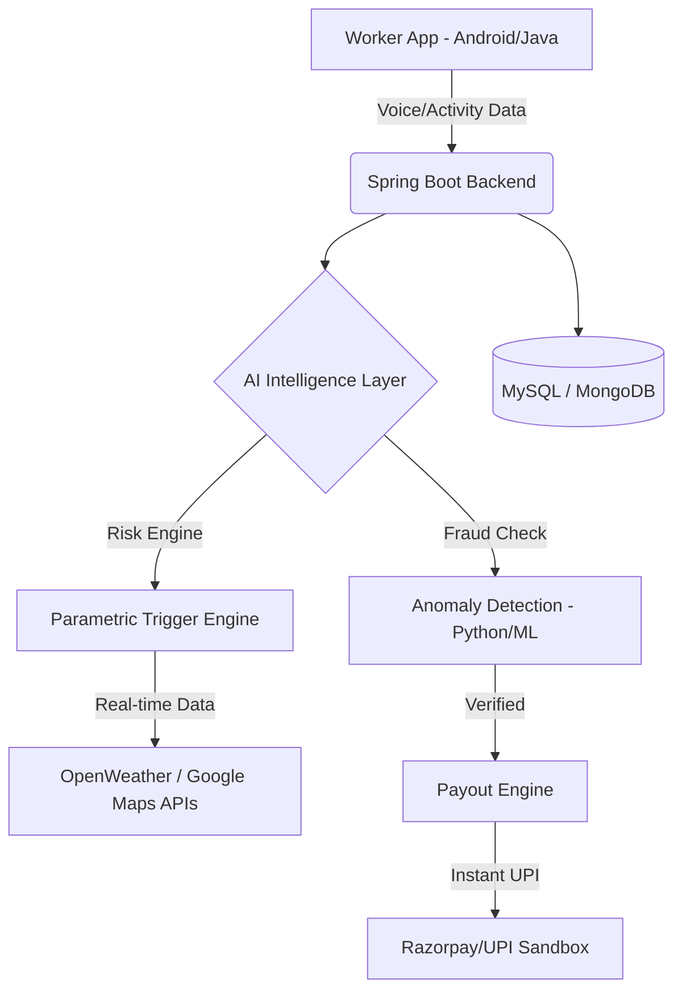

#  GigShield: AI-Powered Parametric Insurance for India’s Gig Economy

**Team Name:** nextgencoders  
**Target Persona:** Q-Commerce & Food Delivery Partners (Swiggy, Zomato, Zepto, Blinkit)  
**Core Mission:** Protecting the backbone of India’s digital economy from income loss due to external disruptions.

---

##  1. The Delivery Persona: "Ravi the Rider"

To build a truly impactful solution, we are designing **GigShield** for workers like Ravi:

| Feature | Profile Details |
| :--- | :--- |
| **Name** | Ravi Kumar |
| **Age / Location** | 26 Years Old | Hyderabad (Hitech City / Gachibowli zones) |
| **Platform** | **Zepto / Blinkit** (Q-Commerce) |
| **Daily Earnings** | ₹700 – ₹900 (Highly dependent on "Daily Milestone" bonuses) |
| **The Pain Point** | During the Monsoon, sudden heavy downpours in Hyderabad cause waterlogging. If Ravi stops for 3 hours, he misses his milestone bonus, losing ~30% of his expected daily income. |
| **Tech Constraint** | Uses a budget Android device; cannot navigate complex apps while wearing rain gear. |

---

##  2. Overview
**GigShield** is an AI-driven parametric insurance platform designed to protect Ravi and millions like him from income loss caused by climatic disruptions (extreme rain, heatwaves) and social restrictions (strikes, curfews). Unlike traditional insurance, GigShield provides **instant payouts without manual claim filing**, using real-time API triggers and AI-verified work activity.

---

##  3. The Problem Statement
In India, platform-based delivery partners lose **20–30% of their monthly earnings** due to:
* **Environmental Factors:** Heavy rain, floods, and severe heatwaves that halt deliveries.
* **Social Disruptions:** Unplanned curfews, local strikes, or sudden zone closures.
* **The Gap:** Current insurance covers accidents/life but **zero** protection for lost working hours. Workers bear the full financial hit of uncontrollable external events.

---

##  4. The "GigShield" Solution
* **Loss of Income Only:** Focused strictly on replacing daily wages, not vehicle or health costs.
* **Parametric Automation:** Payouts trigger automatically when predefined thresholds (e.g., 50mm rainfall) are met in Ravi's specific GPS zone.
* **Weekly Pricing:** Tailored to Ravi's weekly payout cycle (**Premium: ₹25/week**).
* **Voice-First UX:** "Tap-to-Talk" reporting for hands-free safety while Ravi is on the road.

---

##  5. Key Innovations & AI Features

###  1. Weekly Micro-Premium Model
* **Subscription-Based:** A small deduction from Ravi's earnings every Monday ensures coverage for the week.
* **AI Dynamic Pricing:** A **Random Forest Regressor** adjusts next week’s premium based on hyper-local weather forecasts and Ravi's historical "Trust Score."

###  2. Tap-to-Talk Interface
* **Innovation:** A "Push-to-Action" voice trigger. 
* **Use Case:** If Ravi encounters a local strike, he taps one button and says, *"Road blocked by protest."*
* **Environmental Verification:** The AI analyzes background ambient noise (e.g., heavy rain or crowd noise) as secondary evidence for the claim.

###  3. AI-Powered Fraud Detection
* **Isolation Forest Model:** Detects **GPS Spoofing** by analyzing movement patterns; identifies if a user is "teleporting" to a high-payout disruption zone.
* **Activity Validation:** Cross-references GPS logs with "Active Work Sessions" to ensure Ravi was actually online and working during the disruption.

---

##  6. System Architecture & Tech Stack

### **Architecture**

### **Tech Stack**
* **Frontend:** Android (Java) - optimized for low-resource devices.
* **Backend:** Java (Spring Boot) for secure, scalable transaction handling.
* **AI/ML:** Python (Scikit-learn) for fraud scoring and premium prediction.
* **APIs:** OpenWeather (Weather), Google Maps (Location), Razorpay (Simulated Payouts).

---

##  7. Workflow (Ravi’s Journey)

1.  **Onboarding:** Ravi registers, completes KYC, and pays his first ₹25 weekly premium.
2.  **Tracking:** App runs a lightweight background "Activity Tracker" to log Ravi's online hours.
3.  **Trigger:** * **Auto:** OpenWeather API signals "Severe Rain" in Gachibowli.
    * **Manual:** Ravi uses "Tap-to-Talk" to report a sudden market closure.
4.  **Verification:** AI Fraud Engine validates that Ravi is physically in the zone and was online.
5.  **Payout:** System calculates "Lost Income" (e.g., ₹100/hour) and sends it instantly via UPI.

---
Policy Smart-Contract Terms
Insured Event: Any external disruption that leads to a >60 minute halt in delivery activity as verified by the GigShield Risk Engine.

Benefit Amount: Fixed hourly compensation based on the median earnings of the chosen persona (Food/Q-Commerce).

Verification: Multi-factor validation using OpenWeather API (Environmental) + GPS Heatmaps (Social/Crowd activity).

Termination: Policy lapses immediately if the Weekly Premium is not paid or if the AI Fraud Score exceeds the 80% threshold.
##  8. Roadmap & Pitch
* **Week 1-2:** Ideation, Persona Research, and Foundation.
* **Week 3-4:** Building the Parametric Engine and Dynamic Pricing.
* **Week 5-6:** Finalizing Fraud Detection and Instant Payout Simulation.

**One-Line Pitch:** *"GigShield provides AI-powered, claim-less income protection for India's delivery partners via a simple weekly subscription and instant parametric payouts."*

